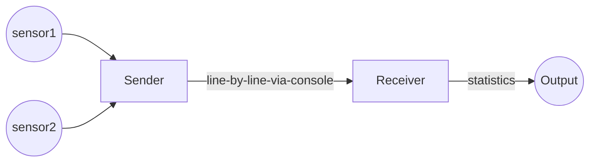
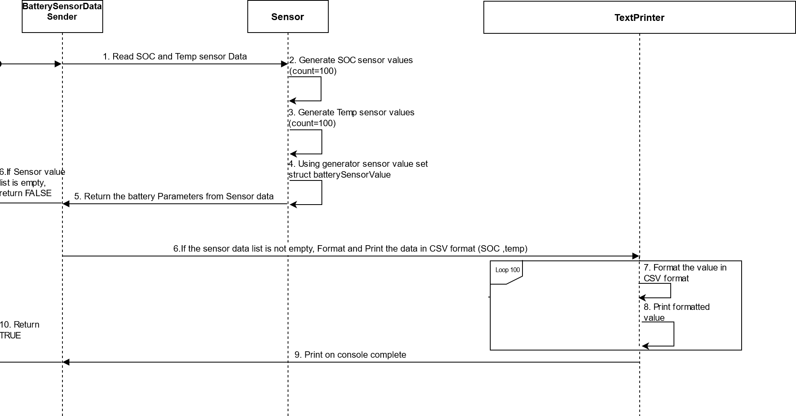

# Streaming BMS Data

This project is about sending and receiving BMS data.

## Decomposition

At a top level, the program runs in two processes - the sender and the receiver.

The Sender simulates and processes data from sensors. It sends data line-by-line to the console, in a format that it defines.
The Receiver inputs this data and computes statistics.

The Sender sends data to the Receiver using [console redirection and pipes](https://ss64.com/nt/syntax-redirection.html).
They need to run on the command-line as follows:

`sender-executable | receiver-executable`

This would make the console-writes of the sender
become the console-reads of the receiver.
It gives us the flexibility of decoupling the sender and receiver -
they can even be written in different languages.

## Phases

The project is divided into two phases:

- Develop the Sender in the first phase, complete with test cases. The syntax and meaning of the data must be evident by reading your test cases.
Do not develop the Receiver yet.

We will instruct you to handover your Sender to another participant and take-over another Sender.

- Develop the Receiver for the Sender you take-over.

## The Interface

We document the interface between the Sender and the Receiver as test cases.

The Sender and Receiver are testable on their own:

- The Sender is testable without the Receiver - so we can develop
for another sensor, test and be confident about integration.
- The Receiver is testable without the Sender - so we can enhance with additional statistics,
without re-testing against all Senders again.

## Decomposition of responsibility

The naming of source files within the Sender and within the Receiver
give their internal decomposition.

## Minimum Functionality

This section lists the minimum functionality of the Sender and Receiver.

### The Sender

- simulates and sends at least two Battery / Charging parameters
- sends fifty readings in a stream
- can either generate values for the parameters, or read from a file
- uses console output to communicate the parameters.

**Assumptions:**
1. Two sensors: Temperature and SOC sensor will generate 100 readings each. Temperature value is generated between -20 to 60. SOC data is generated between 20-80.
2. These sensor value list is the parameter of Battery. So a struct is defined as below:
    struct batterySensorValue{
    vector<unsigned int> stateOfChargeSensorValueList;
    vector<signed int> temperatureSensorValueList;
    };
 3. After the sensor value generation, the list shouldnot be empty
 4. The sensor value should be generated in CSV format
    
**UML diagram:**

    
**Code flow:**
1. Read the sensor values from 2 different sensors. These sensor values are generated randomly.
2. SOC sensor value should be between 20 to 80. There should be 100 values generated and added to batter paramter structure.
3. Simlarly temperature sensor value should be between -20 to 60. There should be 100 values generated and added to batter paramter structure.
4. After the batterySensorValue structure is updated, check the size of this sensor value list.
5. If any one of the list is empty, then return false, without printing any data on console.
6. If the list is valid, then foramt the value in CSV format(SOC,temp) and print them on console.
    
 **Test specification:**
  1. **Test whether the random Sensor value generator is generating expected numbder of values and within given range:**
     Here the count set is 100 and the min value: 1 and max value:50. Then, generateRandomSensorValues() is tested.
     Expectation: After the random value list creation, the elements in the list should be 100 and each value should be in the range 1-50.
  2. **Test whether the battery sensor data values are generated properly:** 
     The battery parameters contain SOC and Temperature Sensor. The SOC value should be in range 20 to 80, temperature value should be in range -20 to 60. And the total count of values from each sensor is 100.
     Expectation: Random sensor value list of size 100 within given range is generated
  3. **Test whether the sensorValueDisplayFormatter is formatting the values in expected CSV format:** 
     Two valid integers: 10 and -20 are given as input.
     Expectation: The formatted string will be in CSV format, ie, 10,-20
  4. **Behavioural testing for print functioanlity:**
     Test whether the displayBatterySensorValueList is displaying all the values on console using mocking.Sensor values are geneated using random functionality.After reading the sensor value, print them on the console.
     Expected: Format and print functionality should be called 100 times, as its the count of sendor data to be read.
  5. **Test whether the data is sent to the reciever successfully:**
     Using actual functionality, the sensor values are generated. After the sensor value generation value will be formatted and then print them on the console. The value should be printed successfully on console.
     Expectation: returns TRUE, since the sensor data are read properly.
  6. **Test whether the data is sent to the reciever successfully with mock functionality(behavioural testing):**
     Using actual functionality, the sensor values are generated.After the sensor value generation value, mock interface is used to verify.
    Expectation: The value should be printed successfully on console, mock interface is used to verify whether the formatting and print functionality are called 100 times.
    
### The Receiver

- reads the parameters from the console input
- after reading every parameter, it prints the following:
    - maximum and minimum values in the incoming stream
    - [simple moving average](https://www.investopedia.com/terms/s/sma.asp) of the last 5 values

## Quality Parameters

Setup the quality parameters of your project (duplication, complexity, coverage, warnings) using GitHub workflow yml files.
